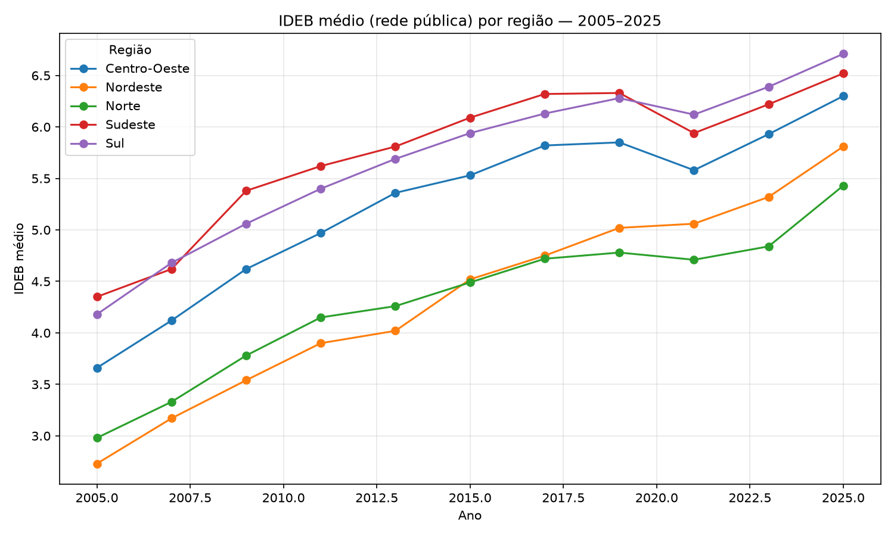
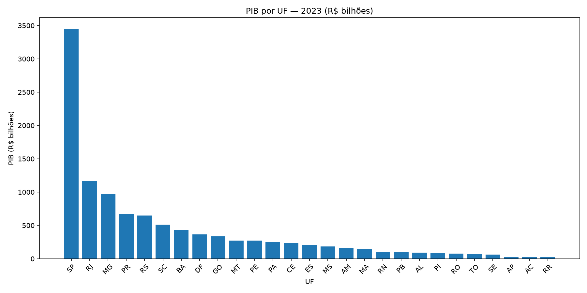

# GovData ETL Pipeline

Pipeline ETL **end-to-end** com dados públicos brasileiros: IBGE (estados, população e PIB) e INEP (IDEB por município). Extração → PySpark → Parquet → PostgreSQL → orquestração com Airflow → visualização com Power BI.

> Projeto de portfólio com arquitetura de data engineering em produção: camadas separadas, schema no modelo dimensional (estrela), recuperação automática de falhas na orquestração e CI.

## Arquitetura

```
dados públicos (IBGE APIs + INEP download)
      │
      ▼
┌───────────────────┐     ┌───────────────────────┐
│  Extração        │     │  Orquestração (Docker) │
│ IBGEExtractor     │     │  Apache Airflow 2.8    │
│ INEPExtractor     │────►│  govdata_pipeline      │
│ (JSON em data/raw)│     │  extract ▸ transform   │
└───────────────────┘     │  ▸ load (retries auto) │
                          └───────────┬───────────┘
                                      │
              ┌───────────────────────┼────────────────────┐
              ▼                       ▼                    ▼
┌──────────────────────┐  ┌────────────────────────┐  ┌────────────┐
│ Transformação        │  │ Carga                  │  │ Consumo    │
│ PySpark → Parquet    │─►│ PostgreSQL (star model)│─►│ Power BI   │
│ (schema explícito)   │  │ dim_estado + 3 fatos   │  │ (próximo)  │
└──────────────────────┘  └────────────────────────┘  └────────────┘
```

## Datasets

| Dado | Fonte | Formato | Colunas principais |
|---|---|---|---|
| Estados | IBGE localidades | 27 UFs | id, sigla, nome, região |
| População | SIDRA **tabela 4714** | 27 registros | UF, ano, população |
| PIB | SIDRA **tabela 5938** | 54 registros | UF, ano, variável, valor |
| IDEB por município | INEP (arquivo oficial) | ~159 mil registros | município, UF, rede, ano, ideb |

> Detalhe de qualidade: o INEP usa o sentinela `"-"` (e `"..."`) para IDEB não divulgado — o pipeline converte para `NULL`, que no Postgres deixa de "envenenar" médias e ordenações (NaN propaga em agregações).

## Estrutura do projeto

```
govdata-etl-pipeline/
├── src/
│   ├── extraction/        # ibge_extractor, inep_extractor
│   ├── transformation/    # spark_processor (PySpark → Parquet)
│   ├── loading/           # postgres_loader (star schema)
│   └── utils/             # config (paths, creds, endpoints)
├── airflow/dags/          # govdata_pipeline.py
├── docker-compose.yml     # postgres:13 + airflow (webserver/scheduler)
├── Dockerfile             # imagem airflow + pyspark/openpyxl/pyarrow
├── tests/                 # pytest (offline + Spark E2E sintético)
├── data/                  # raw/ (JSON), downloads/, processed/ (Parquet) — gitignored
├── sql/                   # queries de validação do modelo
└── notebooks/             # exploração (a definir)
```

## Pré-requisitos

- **Python 3.9+** (testado com 3.13)
- **JDK 17 ou 25** (PySpark)
- **Docker Desktop** (PostgreSQL + Airflow)
- No Windows, os **binários nativos do Hadoop** compatíveis com a versão do Spark (ver Troubleshooting)

## Rodando no host (Windows)

```bash
python -m venv venv
venv\Scripts\activate
pip install -r requirements.txt

# Spark no Windows precisa do caminho do Hadoop nativo no PATH do processo
$env:Path = "$env:Path;D:\hadoop\bin"
$env:PYTHONUTF8 = "1"

# 1) Extração
python -m src.extraction.ibge_extractor
python -m src.extraction.inep_extractor

# 2) Transformação (PySpark → Parquet em data/processed)
python -m src.transformation.spark_processor

# 3) Carga no PostgreSQL (detecta host automaticamente)
python -m src.loading.postgres_loader
```

## Rodando com Docker/Airflow

```bash
docker compose up -d

# DAG fica em http://localhost:8080 (govdata_pipeline)
docker compose exec airflow-webserver airflow dags trigger govdata_pipeline
docker compose exec airflow-webserver airflow tasks states-for-dag-run \
  govdata_pipeline <dag_run_id>
```

O volume `./data` é montado em `/opt/airflow/data`: os Parquet gerados no container são os mesmos gerados no host.

## Modelo de dados (star schema)

```
                 ┌─────────────────────────┐
                 │ dim_estado              │
                 │ id_estado PK, sigla,    │
                 │ nome, sigla_regiao,     │
                 │ nome_regiao             │
                 └──┬──────────┬─────────┬─┘
                    │          │         │
        ┌───────────┤        ┌─┴──┐   ┌──┴───────────┐
        ▼           │        ▼    │   ▼
┌───────────────┐  │  ┌────────────┐   ┌───────────────┐
│ fato_populacao│  │  │ fato_pib   │   │ fato_ideb     │
│ id_estado FK  │  │  │ id_estado  │   │ id_estado FK  │
│ ano, populacao│  │  │ ano,variavel│   │ cod/uf/rede/  │
└───────────────┘  │  │ valor,unid.│   │ ano,ideb      │
                   │  └────────────┘   └───────────────┘
```

## Testes e CI

```bash
pytest -v
```

- Sem rede: config, loader (`NaN → NULL`), lógica de extração e sentinelas.
- Com PySpark: transformação E2E em dados sintéticos (cobre as regressões de schema misto int/float/null).
- GitHub Actions roda a suíte em **Python 3.11/3.12 + JDK 17** (ubuntu), provando que o pipeline não depende do Windows.

## Troubleshooting

**PySpark no Windows — `UnsatisfiedLinkError: NativeIO$Windows.access0`**
- A versão dos binários nativos do Hadoop precisa casar com a do Spark. Ex.: PySpark 4.2.0 embute _Hadoop 3.5.0_ → baixe `hadoop-win-utils`/`hadoop.dll` 3.5.0 (ex.: release `notepass/hadoop-native-win-libs`) em `D:\hadoop\bin`.
- Com **JDK 25**, mesmo com os binários certos, o JNI fora de ordem faz o símbolo `access0` não ser carregado. A solução embutida no `SparkProcessor.__init__` é carregar o `hadoop.dll` explicitamente via `System.load`.

**`UnicodeEncodeError` nos prints**
- Defina `PYTHONUTF8=1` no terminal Windows (emojis/acentos no console cp1252).

**`json.decoder.JSONDecodeError` ou `NaN` na carga**
- Nunca use `Series.where(cond, None)` em coluna numérica do pandas: ele **mantém NaN**. Use `astype(object)` + preencher `NaN` com `None` (ver `postgres_loader._to_nullable`).

**Spark 4: `CANNOT_MERGE_TYPE` / `DoubleType can not accept int`**
- Inferência de schema no `createDataFrame` não aceita coluna com int/float/None. Use **schema explícito** e normalize os tipos Python antes.

**INEP: `download.inep.gov.br` falha no SSL (OpenSSL/certifi)**
- Cadeia de certificados incompleta no servidor. Como é dado público, o extrator usa `verify=False` + `urllib3.disable_warnings` (documentado no código).

**Docker: "server closed the connection" no `localhost:5432`**
- Port-forward do Docker Desktop pode ficar instável; o dado continua íntegro dentro da rede docker. Verifique com `docker compose exec airflow-webserver python -c "..."` ou `docker compose restart postgres`.

## Dashboard Power BI

Camada semântica em `sql/views.sql` + modelo em `powerbi/` e prévias geradas direto do PostgreSQL:




Para reproduzir o `.pbix`, siga `powerbi/README.md` (conexão PostgreSQL `localhost:5432`/`govdata`), importe as medidas de `MEASURES.dax` e o layout de `REPORT_SPEC.md`.

## Documentação e exploração

- `docs/ARCHITECTURE.md` — decisões e fluxo entre camadas
- `docs/DATA_DICTIONARY.md` — dicionário das tabelas e views
- `notebooks/01_exploracao.ipynb` — EDA interativa (PostgreSQL ou Parquet como fallback)

## Roteiro

- [x] Extração IBGE + INEP
- [x] Transformação PySpark → Parquet (com correções para Windows 10/11 + JDK 25)
- [x] Carga PostgreSQL (star schema)
- [x] Orquestração Airflow (DAG completa, retries automáticos)
- [x] Testes + CI
- [x] Dashboard Power BI (views, modelo, medidas DAX e prévias)
- [x] Documentação e notebook de exploração